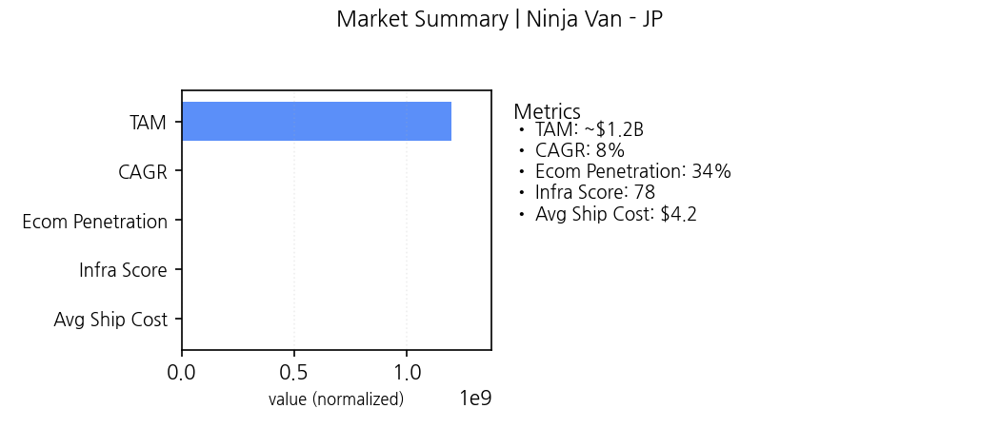
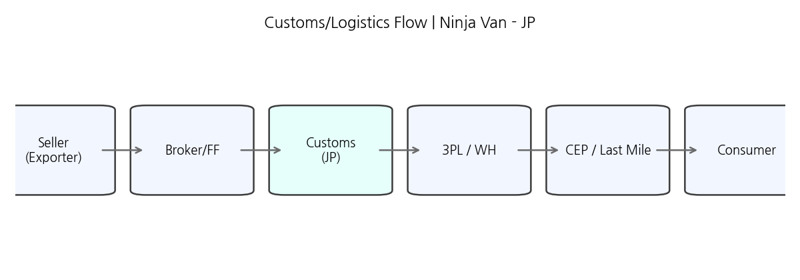
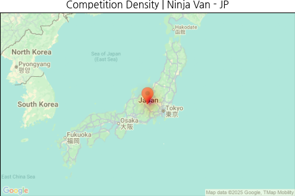
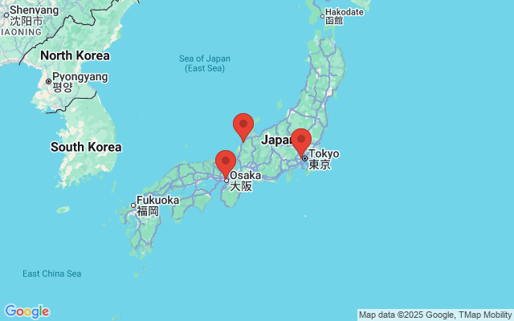

# Ninja Van × JP 전략 카드
## 요약
- 결정: **RECOMMEND** (coverage=60%, TBD=30%, score=65)
- 규제 커버리지: 60% (TBD 30%, Risk=높음)
- 우선 GTM: mid

## 시장
- Why Now: 크로스보더 수요 증가와 물류 인프라 개선으로 진입 타이밍 양호
- 지표: {'TAM': '~$1.2B', 'CAGR': '8%', 'Ecom Penetration': '34%', 'Infra Score': '78', 'Avg Ship Cost': '$4.2'}

## 규제
- Blocker: False

## 경쟁
- 화이트스페이스:
- SE corridor
- Port-adjacent SMB
- Cross-border niche

### 경쟁사 히트맵

### 주요 마커 지도

## GTM
- 선택: mid

| Segment | Score | ICP | Offer |
|---|---:|---|---|
| mid | 4.7 | 중견/성장 셀러 | 표준 풀필+가이드 킷 |
| high | 4.1 | 엔터프라이즈/대형 셀러 | 전담 풀필+SLA+규제패키지 |
| low | 3.9 | SMB/크로스보더 시범 | 셀프서비스+라이트 풀필 |

## 파트너
- ABC Customs (Customs) · priority=High
- XYZ 3PL (3PL) · priority=Mid
- SI-One (SI) · priority=Mid

## 리스크
- 규제 해석 지연 · prob=M · impact=H · mitigation=로펌 의견서 (trigger: coverage<0.8)
- SLA 미달 · prob=M · impact=M · mitigation=대체 3PL (trigger: OTD<95%)

## 의사결정 점수카드
| 항목 | 값 |
|---|---|
| base | 70 |
| coverage | 0.6 |
| tbd_ratio | 0.3 |
| competition_high | False |
| partners | 3 |
| final | **65** |