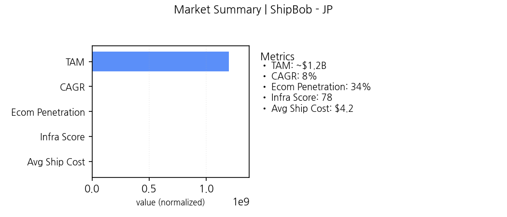
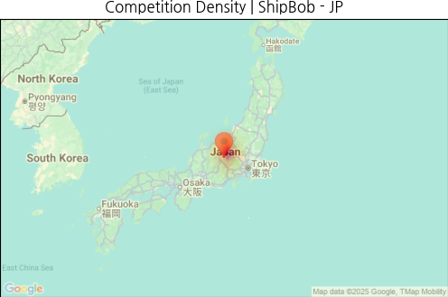
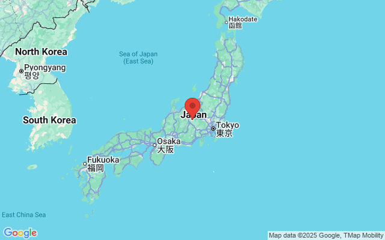

# ShipBob × JP Market Entry
## Executive
- Decision: **RECOMMEND** (coverage=60%, TBD=30%, score=65)
- Regulation Coverage: 60% (TBD 30%, Risk=High)
- Chosen GTM: high

## Market
- Why Now: Cross-border growth tailwinds: ecom penetration up, logistics infra maturing, and cost curves improving.
- Metrics: {'TAM': '~$1.2B', 'CAGR': '8%', 'Ecom Penetration': '34%', 'Infra Score': '78', 'Avg Ship Cost': '$4.2'}

## Regulation
- Blocker: False

## Competition
- Whitespaces
- SE corridor
- Port-adjacent SMB
- Cross-border niche

### Competition Heatmap

### Competitor Map

## GTM
- Selected: high

| Segment | Score | ICP | Offer |
|---|---:|---|---|
| high | 3.2 | Enterprise eCommerce / 3PL integrators | Premium cross-border SLA + compliance support |
| low | 3.0 | SMB / emerging sellers | Self-serve platform + basic support |
| mid | 2.8 | Mid-market brands / regional D2C | Standardized cross-border suite with tiered support |

## Partners
- Sagawa Express (3PL) · priority=High
- Japan Customs (Customs) · priority=High
- Rakuten SI (SI) · priority=Mid

## Risks
- Regulatory coverage gap · prob=M · impact=H · mitigation=Prioritize MUST items; engage local counsel (trigger: coverage<0.8)
- High TBD ratio · prob=M · impact=M · mitigation=Accelerate evidence collection and PoCs (trigger: tbd_ratio>=0.2)

## Decision Scorecard
| key | value |
|---|---|
| base | 70 |
| coverage | 0.6 |
| tbd_ratio | 0.3 |
| competition_high | False |
| partners | 3 |
| final | **65** |